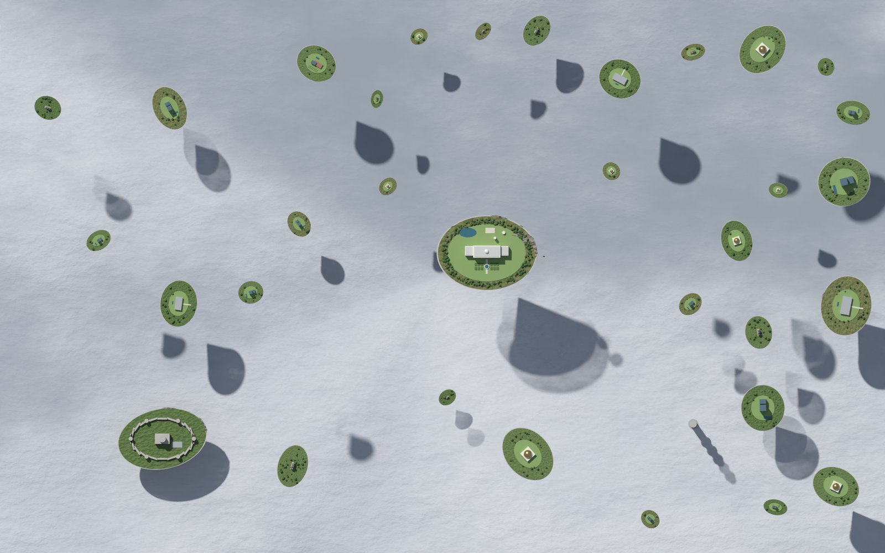

# 上层云海重做（云端任务 4 · 1）

结论：选 **metaball 融合的积云团 + 三阶着色（《部落冲突》式）**，岛影由「云用太阳」单独投射。代码在 `blender/tc_clouds.py`。`tiancheng_upper.py --below clouds` 时自动调用，只加了一行。
- 选定草稿：`docs/drafts/clouds_v3_toon.jpg`
- 新旧对比：`docs/drafts/clouds_old_vs_v3.jpg`
- 8K 局部：`docs/drafts/clouds_v3_toon_8k_crop.jpg`

## 1. 旧版的问题

- **云是两张噪声平面**：顶视下像一张起伏的白纸，读不出「厚云层」。
- **影子是一块块水滴形的深色斑**，有两个原因：
  1. 岛下面倒锥形的岩体也在投影。锥体的影子正好是水滴形，而且比岛面大。
  2. 三层共用的太阳天顶角是 40°。岛比云顶高 1–8 单位（100–800 m），影子偏出 1–7 单位，和岛完全脱开，看不出是谁的影子。
- 结果是满屏「来历不明的暗斑」。

## 2. 调研

### 游戏里的云海 / 云影

| 作品 | 云的做法（俯视或高空视角） | 可借鉴 |
|---|---|---|
| 部落冲突 / 皇室战争 | 地图边缘和加载画面的云：厚实的圆团叠成一整块，明暗只有两到三阶，背光面是柔和的蓝灰，没有细碎噪点，轮廓线干净 | 三阶着色、蓝灰阴影、大团少碎；云只作衬底，饱和度低于地块 |
| Townscaper | 水面与天空都是低频的大色块，靠少量高光表现材质 | 大面积留白比细节更「贵」 |
| Islanders | 极简低多边形。岛的影子就是岛轮廓的平移，边缘柔化，一眼能配对 | 影子与岛同形、就近，决定了「浮起来」的读感 |
| Bad North | 岛悬在雾海上。岛下沿是一圈暗色，雾海几乎纯色 | 岛与底面之间要有明暗对比，底面不能抢细节 |
| 光遇（Sky） | 云海是大片柔和体积加雾化远景，靠色调分层表现深度（thatgamecompany 2020 年 GDC 美术分享） | 云缝里「更低、更暗、更蓝」就能表现厚度 |
| 塞尔达：王国之泪（天空岛） | 岛下方是写实体积云海，岛投下的影子柔、近。高度靠影子偏移和大气透视表现 | 岛越高，影子越远、越虚 |

### Blender 里的做法对比（正俯视、8000 px、本机 M 系列 GPU，上层原本约 8 分钟）

| 做法 | 优点 | 缺点 | 结论 |
|---|---|---|---|
| 实例化圆球团 + 阶梯着色 | 快、可控 | 球与球相交处有折痕，顶视像「一堆泡沫球 / 棉花球」（首轮试过，`t2` 预览） | 否 |
| **metaball（融合球）** | 团与团自动融合成连续的积云块，轮廓圆润干净；转成网格后可以按顶点着色 | 8K 下要细网格（0.035 单位），生成约 70 秒、约 220 万顶点 | **采用** |
| 低分辨率体积云 | 最写实，边缘有透光 | 8K 下噪点重、渲染时间成倍增长；和岛的写实程度不一致；阴影难控 | 否 |
| 2D 噪声遮罩平面 + 法线假厚度（旧版） | 最快 | 读不出体积；影子无处可落，只能在平面上显示为暗斑 | 否 |

### 岛影怎样才合理

1. **与岛同形**：只让岛面（连同上面的树和楼）投影。岛下的岩体设为不投影，它在俯视图里本来就看不见。
2. **落在云顶上、离岛不远**：云单独用一盏「云用太阳」。
   - 方位角与三层共用的太阳一致（`tc.SUN_ROT` 的 215°），天顶角 14°。
   - 影子偏移约为「高差 × 0.25」：低岛的影子紧贴岛，高岛的影子离开一点。
3. **柔边、越高越虚**：云用太阳的圆盘角是 5°，影子的虚化宽度约为「高差 × 0.087」。
4. **灯光链接（Cycles 4.0 起）**：主太阳照岛、不照云；云用太阳只照云，但所有物体都能挡它。
   - 岛上的受光方向不变。
   - 云的三阶明暗按主太阳方向烘进底色，所以云和岛的「光从哪边来」一致。
   - 云用太阳几乎垂直，把顶面照得均匀，岛影直接压暗底色，干净、不花。
   - 注意：中层的「上层投影」仍按主太阳的 40° 偏移，那是另一张图，互不影响。

## 3. 实现（`blender/tc_clouds.py`）

`build_cloud_sea(layer, islands, sun)` 依次做这些事：

1. **删掉旧版**的两张噪声平面。
2. **岩体不投影**：带 `rock` 材质的倒锥不再投影。
3. **排云团**：六边形抖动网格，间距 300 m。
   - 每格的浓度 = 低频 FBM 与中频 FBM 之和。低于阈值的格子留作云缝。
   - 每团：一个主团、3–5 个外圈小团、2–4 个顶部鼓包，都是扁椭球（竖向 0.62）。
   - 靠近低空岛的云团，云顶压到岛面以下 35 m，不穿模。
4. **伊甸「云台」**：伊甸椭圆 1.45–1.8 倍处排一圈 16 团饱满的亮云，顶点亮度 +8%，主角岛一眼可见。
5. **metaball 融合后转网格**。分辨率随出图尺寸变化：2000 px 时 0.09，8000 px 时 0.035。
6. **材质**（漫反射，底色三阶）：
   - 明暗值 = 0.6 ×（法线 · 指向主太阳）+ 0.4 × 法线朝上的分量。
   - 色阶依次是蓝灰 `(.46,.52,.64)`、过渡 `(.62,.67,.77)`、受光 `(.80,.81,.83)`。阶与阶之间有 0.05 的窄过渡，8K 下不会出锯齿。
   - 受光色故意不到纯白，给岛留出对比。
7. **底云**：比云团低 250 m 的一张暗灰蓝平面。云团的影子落进云缝，读出云层的厚度。
8. **灯光**：云用太阳（强度为主太阳的 0.7 倍）加上灯光链接。

参数（都可省略）：

| 参数 | 默认值 | 说明 |
|---|---|---|
| `--clouds toon\|soft` | `toon` | `soft` 是写实积云对照版：更碎的团、连续明暗、细噪声凹凸 |
| `--cloud-light` | `.7` | 云用太阳的强度，相对主太阳 |
| `--cloud-res` | 随出图尺寸 | metaball 网格分辨率 |
| `--cloud-geo meta\|spheres` | `meta` | `spheres`：不融合的圆球，仅作对照 |

## 4. 迭代与自评（2000 px，32 采样，云端 CPU 每张约 2 分钟）

**预览（800 px，4 轮，不算正式轮次）**
- 圆球版：太亮、像泡沫球。
- 改 metaball：融合对了，但云缝太多、偏灰，像陶泥。
- 调亮、加密之后进入正式轮次。

**第 1 轮：`clouds_v1_toon.jpg` / `clouds_v1_soft.jpg`**
- 可读性：厚云层与浮岛能读出来；toon 的三阶清楚，soft 的轮廓更自然。
- 怪影：已消失。影子与岛同形，就近落在云上，柔边。
- 比例：云团约为中等岛的 2–4 倍，不抢岛；但伊甸旁边有一大块云缝，主角岛反而落在「洞」边上。
- toon 的顶面偏平，像翻糖；soft 的噪声凹凸像石膏。

**第 2 轮：`clouds_v2_toon.jpg` / `clouds_v2_soft.jpg`**
- 伊甸周围加了一圈亮云（云台），主角岛最显眼。
- toon 增加顶部鼓包；soft 的凹凸减半、尺度放大，但整体像奶油。
- 自评：**选 toon**。更符合「部落冲突式简洁」的要求，岛的轮廓在任何缩放下都清楚。

**第 3 轮：`clouds_v3_toon.jpg`（选定）**
- 底云压低到云团下方 250 m：云团在云缝里投下蓝灰影带，「厚云层」的读感明显增强。
- 8K 局部检查（`clouds_v3_toon_8k_crop.jpg`）：
  - 0.045 网格下，阶梯边沿着面片出现锯齿。改为窄过渡加 0.035 网格后，没有锯齿、橘皮或断线。
- 怪影：无。高岛的影子更远、更虚，符合预期。
- 可读性：
  - 在 800 m 视野下，岛面绿色与云的蓝白对比强。
  - 伊甸在云台中央，全图第一眼。
  - 气候塔穿出云层，位置不变。

## 5. 8K 渲染时间估计（本机）

- metaball 生成约 70 秒（CPU，和 GPU 无关）。
- 云网格约 220 万顶点，在 GPU 上渲染几乎不增加时间：云是单一漫反射材质，没有体积、没有透明。
- 预计比旧版多 1–2 分钟，总计约 10 分钟。

本机重跑：`bash tools/render_all.sh upper --res 8000 --samples 128`

## 参考

- [Art of 'Sky: Children of the Light'（GDC Vault）](https://gdcvault.com/play/1026903/Art-of-Sky-Children-of)
- [See how thatgamecompany created the magical art of Sky（CG Channel）](https://www.cgchannel.com/2020/01/discover-how-thatgamecompany-created-the-magical-art-of-sky/)
- [Creating Fluffy Stylised Clouds（BlenderNation，metaball 加程序纹理）](https://www.blendernation.com/2020/07/26/creating-fluffy-stylised-clouds/)
- [Simple Toon Cloud Tutorial in Blender 2.8 Eevee（YouTube）](https://www.youtube.com/watch?v=2TgXJ632edc)
- 部落冲突、Townscaper、Islanders、Bad North、塞尔达 的描述来自对游戏画面的观察，没有官方技术文档。
