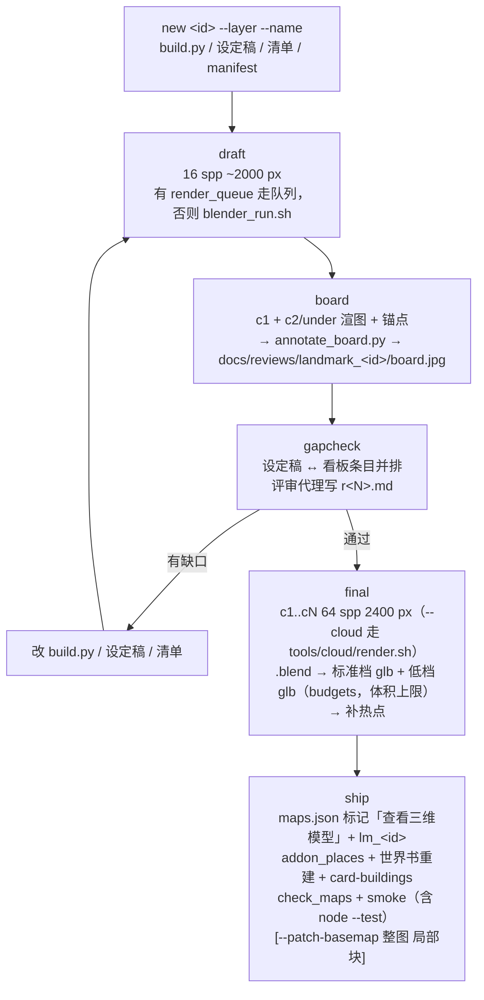

状态：已上线（2026-09-28）——`tools/landmark.py` 可用；渲染队列 `tools/render_queue.*` 落地后 draft / final 自动改走队列。

# 地标一键流水线（`tools/landmark.py`）

新地标（卡里有的建筑 / 地点的三维模型）一律走这条流水线。一个 id 一套文件：

| 文件 | 作用 |
|---|---|
| `blender/landmarks/<id>/build.py` | 建模脚本（`new` 从模板生成骨架，镜头 c1 主视角 / c2 侧视 / under 底视） |
| `docs/landmarks/<id>.md` | 设定稿：一节「设定」（卡里写到的事实带 `docs/card-digest.md` 行号，`new` 自动搜卡名预填） |
| `docs/landmarks/<id>.checklist.md` | 检查清单（报告格式：首行状态，做完的 ~~划掉~~ ✅）；「看板条目」= `- 组名｜说明` |
| `map/props/<id>/manifest.json` | viewer3d 清单；`budgets` 字段 = 组的三角形 / 贴图预算（传给 export_glb.py） |
| `logs/landmarks/<id>.json` | 流水线状态（本机，不入库）；中间文件在 `$LM_WORK`（默认 `/private/tmp/lm_work/<id>/`） |



## 命令

```bash
python3 tools/landmark.py new starabyss_univ --layer tc_mid --name 星渊大学 [--marker 标记id]
python3 tools/landmark.py draft starabyss_univ [--cam c1 --res 2000 --spp 16]
python3 tools/landmark.py board starabyss_univ [--cams c1,c2 --res 1600 --spp 16]
python3 tools/landmark.py gapcheck starabyss_univ [--json]
python3 tools/landmark.py final starabyss_univ [--cloud]
python3 tools/landmark.py ship starabyss_univ --score "r1 7 / 7.5" [--wb-text "…"] [--blurb "…"] [--patch-basemap 整图 局部块 --dzi 前缀]
python3 tools/landmark.py status [id]          # ✓ 有记录；✓* 老地标按产物推断；· 未做
```

- 全局 `--dry-run`：只打印要跑的命令与要写的文件，不起 Blender、不改状态；`--force`：已完成的子步骤也重做。
- **幂等 / 可续跑**：每个子步骤（每个镜头、.blend、标准档、低档）做完记状态；再跑时产物还在且 build.py 没改过就跳过。队列 / 云端中断后直接重跑同一条命令。
- `new` 对已有文件一律不覆盖——老地标补跑 `new` 只会补清单（看板条目从 manifest 热点取）和状态。
- 失败都打印 `✗ 原因` + `提示：下一步怎么办`。
- 内容中立：工具不做内容过滤，只搬文件、跑命令。

## 评审代理怎么用 gapcheck

1. 跑 `python3 tools/landmark.py gapcheck <id>`（机器读用 `--json`），拿到：看板图路径、设定稿「设定」S1…Sn、看板条目（组名｜说明｜看板上有无锚点）。
2. 打开看板图，逐条回答：
   - 每条 S* 由哪个看板条目覆盖？没有 = **缺口**（设定写了、模型没做）。
   - 每个看板条目能否在 S* 里找到依据？找不到 = 补设定或删条目。
   - 图上每个编号指的是否真是所写之物；「缺」= 镜头没拍到或组名写错。
3. 结论写 `docs/reviews/landmark_<id>/r<N>.md`（建筑写实分 / 卡忠实度分 + 缺口清单）；核对过的看板条目在清单里 ~~划掉~~ ✅。
4. 有缺口 → 改 build.py / 设定稿 → 再 draft / board / gapcheck；通过 → final。

## 与其它工具的关系

- 渲染一律经 `tools/blender_run.sh`（GPU 锁、ASCII TMPDIR、崩溃重试）；`tools/render_queue.*` 存在时 draft / final 以 `tools/render_queue.sh submit <draft|final> -- <blender_run 参数>` 提交，队列决定 Mac 还是云端（`LM_QUEUE=0` 强制本机）；board 与 glb 导出要立刻拿到产物，仍直接经 blender_run.sh 同步跑（都是小任务）。
- 看板锚点由 `blender/landmarks/lm_anchors.py` 包装 build.py 生成（每个非 bg_* 组的包围盒中心投到相机），build.py 不用改。
- 世界书同步（worldbook-sync 规则）：标记带 `addon: true` 且 `addon_places.json` 没有它时，`ship` 要求 `--wb-text` 并新增条目，然后跑 `build_worldbook_addon.py --ship`。


## Clay and region studies (R2, 2026-10-01)

Two optional aids sit beside the stages; neither changes the stage records in `logs/landmarks/` or the checklist flow
(the campaign ledger has a `clay` stage after `draft`).

- `python3 tools/landmark.py clay <id> [--cams c1,c2 --res 1600 --spp 16]` — geometry only: every mesh gets one neutral
  matte material, lights and sky are replaced by a fixed grey dome plus one sun, cameras are the build script's own
  (default c1 and c2). The views are stitched side by side into `docs/landmarks/<id>/clay.jpg`. Runs through the
  render queue; run the command again once the jobs finish to collect the sheet. Implemented by
  `blender/landmarks/lm_variant.py` (wraps `build.py`, which is not edited).
- `python3 tools/landmark.py study <id> --region x0,y0,x1,y1 [--cam c1 --res 2000 --spp 32]` — renders only that
  crop of the frame (Blender render border + crop), writes `docs/landmarks/<id>/study_<n>.jpg`, and, when a draft of the
  same camera exists, `study_<n>_ctx.jpg` with the crop pasted into it via `tools/region_patch.py`.
