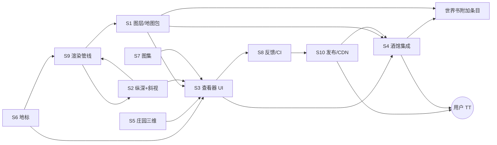

# 项目总体设计（伊甸地图，2026-09-28）

> 状态：设计总览 v1，未开始实施；做完的条目在原文用 ~~删除线~~ ✅ 划掉，由实施的代理负责回来划。细节以各分文档为准，本页只做索引与排序。

## 1. 产品是什么（5 行）

- 酒馆助手（TavernHelper）外挂地图：天城上 / 中 / 下层 + 伊甸庄园 + 世界图，原卡作者 Yehehua，派生许可要求首发帖链接原帖。
- 交付只有两样：外挂脚本（`【地图】伊甸地图` 加载器 / 跟随版脚本）+ 世界书附加条目；不生成、不修改角色卡。
- 运行时全部走 jsDelivr：加载器读 `map/data/head.json` 取跟随分支 `cloud/tc-mid-low` 的内容提交号，再按提交号加载 `map/**`（不可变 URL）。
- 地图读卡的 MVU 变量显示地点 / 人物 / 事态，写聊天只填输入框、不自动发送；不过滤用户聊天内容。
- 正式版停在 0.9.5（发版暂停，等作者沟通）；跟随版事实上就是线上版，Mac 桌面优先，iPhone 最低优先。

## 2. 子系统地图

格式：负责文件 ｜ 接口 ｜ 数据 ｜ 测试。

- **S1 图层 / 地图包**：`map/core/pack.mjs`、`map/app/layers.mjs`、`map/app/pack.mjs`、`map/packs/{eden,town}/manifest.json`、`tools/new_pack.py` ｜ pack manifest（schema 待冻结 v1）、maps.json 层定义 ｜ `map/data/maps.json`、`tc_{upper,mid,low}.json`、`site_*.json`、`map/data/schema/` ｜ `tests/pack.test.mjs`、`schema_maps.test.mjs`、`tools/check_pack.py`、`tools/browser/pack_town.mjs`。
- **S2 纵深 + 斜视**：`map/core/depth.mjs`、`map/core/project.mjs`、`blender/depth.py`、`blender/project.py`、`blender/oblique.py`、`tools/oblique_post.py`、`tools/upper_depth_post.py` ｜ `depthOf/channel/cloudsAbove`、`fit_camera/project/label_rule`、`<out>.meta.json` ｜ `map/data/upper_depth.json`、`blender/data/tc_islands*.json`、`tc_upper_markers.json` ｜ `tests/depth.test.mjs`、`project.test.mjs`、`fixtures/*_golden.json`、`tools/test_depth.py`、`test_project.py`。
- **S3 查看器 UI**：`map/viewer.html`、`map/app/*`（boot/shell/topbar/markers/nav/settings/fog…）、`map/ui/*`（sheet、notice、chrome3d、icons、progress、tokens.css）、`map/i18n/` ｜ `TCSettings.registerSection`、通知层 P0–P3、`app/plugins.mjs` + `extapi.mjs` ｜ maps.json `view.phone` ｜ `app_modules.test.mjs`、`i18n_parity.test.mjs`、`fog.test.mjs`、`tools/browser/fix3.mjs`、`v2a.mjs`、`uiv2_shots.mjs`。
- **S4 酒馆集成（MVU / TH / 世界书同步）**：`map/tavern/eden-map.js`（1340 行入口）、`mvu.mjs`、`th.mjs`、`wbsync.mjs`、`modes.mjs`、`snapshot.mjs`、`selfcheck.mjs`、`adapter.mjs`、`follow.mjs`、`map/core/protocol.mjs` ｜ postMessage 协议 PROTO=2（`eden-map:*`、`estate:*`）、`initializeGlobal('EdenMap')`、`eden-map:moved`、宏 `{{eden_here}}` ｜ `addon_places.json` → `tools/build_worldbook_addon.py --ship` → `worldbook_addon.json`、`core/storage.mjs SCRIPT_KEYS` ｜ `mvu.test.mjs`、`wbsync.test.mjs`、`th_foundation.test.mjs`、`protocol.test.mjs`、`postmessage.test.mjs`、`selfcheck.test.mjs`、`tools/browser/th_adopt.mjs`。
- **S5 庄园三维**：`map/estate/{index.html,main.js,plan.js}`、`blender/estate2/*`（export_web、web_scene、zones…）、`app/estate.mjs` ｜ `estate:*` 消息、chrome3d 外壳 ｜ `eden_estate_rooms.json`、`eden_estate_tiles.json`、`map/estate/model/*.glb` ｜ `tools/browser/estate3d.mjs`、`viewer3d_perf.mjs`。
- **S6 地标（单体建筑三维）**：`blender/landmarks/<id>/`、`common.py`、`export_glb.py`、`map_cutout.py`、`map/props/<id>/` + `viewer3d.html` ｜ 道具查看器 URL 参数 + chrome3d ｜ `docs/card-buildings.md`、`docs/landmarks/*.md` ｜ `tools/browser/props_u12.mjs`；一键管线待建。
- **S7 图集**：`map/ui/gallery.js`、`room-gallery-panel.js`、`map/core/room-gallery-{db,logic}.mjs`、`tools/gallery_review.py` ｜ IndexedDB 本地图、`safeGalleryImagePath`、维护者模式 ｜ `gallery.json`、`room_galleries.json`、`map/art/gallery/<roomId>/` ｜ `room_gallery.test.mjs`、`tools/browser/{gallery,room_gallery_ui}.mjs`、check_maps 门控。
- **S8 反馈 / CI**：`map/app/feedback.mjs`、`feedback-report.mjs`、`.github/workflows/ci.yml`、`tools/smoke.sh`、`tools/check_maps.py` ｜ 反馈按钮 → 预填 GitHub issue ｜ `logs/*.csv` ｜ `feedback_report.test.mjs`、`check_maps_committed.test.mjs`；CI 跑 `node --test` + smoke。
- **S9 渲染管线**：`tools/blender_run.sh`、`render_all.sh`、`region_patch.py`、`make_dzi.py`、`dzi_mosaic.py`、`check_render_deps.py`、`blender/tiancheng_{upper,mid,low}.py`、`tc_*.py`、`upper_islands/*`、`world_render.py` ｜ 整图 PNG → 后处理 → DZI ｜ `map/art/**`、`docs/render-deps.md`、`logs/render_times.csv` ｜ `make_dzi.test.mjs`、`tools/check_render_deps.py`、`bench_render.sh`。
- **S10 发布 / CDN**：`tools/bump_head.py`、`warm_cdn.sh`、`ship.sh`、`build_preview_script.py`、`verlib.py`、`version_code.py`、`check_version.py`、`pack_npm.sh` ｜ head.json `{build,sha,branch,at}`、build.json `{code,version}`、标签 `map-vX.Y.Z[.P]` / `map-s<n>-v…` ｜ `VERSION`、`CHANGELOG.md`、`map/data/{head,build}.json` ｜ `follow_head.test.mjs`、`version097.test.mjs`、`worldbook_addon_release.test.mjs`。

## 3. 依赖图

## 4. 工作线与顺序

### 4.1 渲染线（GPU 独占，只能串行）

- R1 中层建筑剩 4 处：天城大学 + 最高法院（同一批）→ 风暴殿 → 骑士团营区 → 维多利亚的公寓；中层不等用户确认，渲完直接接下一项。
- R2 上层岛：逐岛资产（`blender/upper_islands/isle*.py`）全部出齐 → 上层斜视 8K 整图（用户确认后）。
- R3 下层 / 世界图：等用户批准后才开工。
- 规则：R1 → R2 → R3 串行；同一时刻只一个 Blender 任务（`blender_run.sh` 显卡锁）；GPU 不空转，R1 渲染时代理可以并行准备 R2 的场景脚本。

### 4.2 代码 / 文档线

- C1 地标一键管线（卡内行号 → 参考板 → 灰模 → 渲染 → glb → props 接入 → 世界书）；可与 R1 并行，且 R1 剩余项可以先用它。
- C2 架构整理：fog 合并进 `core/depth`（U19）→ Eden 包只留 manifest（删 `core/pack.mjs` 的 EDEN 常量）→ 冻结 pack schema v1 → 拆 `eden-map.js`（入口 / 线路 / 生命周期 / TH 适配）。四步内部串行。
- C3 改名 + 命名统一（见 §5）：必须所有代理空闲、所有 worktree 已合并或丢弃、GPU 空闲时单独做，是全项目唯一的全局停机点。
- C4 git 瘦身 + 瓦片出主仓：放在 C3 之后（路径已稳定），并在下一次整层重渲之前完成。
- C5 上层真 3D 模式：依赖 R2 逐岛资产和 C2 的 depth 合并。
- C6 创意工坊：依赖 C2 的 schema v1、C5 和斜视 8K（槽位基于纵深），最后做。

### 4.3 并行 / 串行一览

- 可并行：R1 ∥ C1 ∥ C2（最多 2–3 个代理）。
- 可并行：R2 ∥ C2 后半 ∥ UI 重构待办（U15–U18）。
- 必须串行：C2 → C3 → C4；R2 → C5 → C6。
- 全局停机：C3（改名）要求所有代理空闲；C4 改写历史时同样停机。
- 推送攒批：每 2–3 项推一次；纯文档推送不需要 bump_head。

## 5. 命名规则（用户 2026-09-28）

规则：版本名和所有与版本相关的信息只用英文字母、数字（及 `.` `-` `_` `/` `#` 分隔符）；用户看到的显示文字保持中文。

### 5.1 覆盖范围

- 版本字符串、`head.json` / `build.json` 字段、构建编号、版本编码。
- 分支名、标签名、worktree 与文件夹名。
- 文件名、资产 id（房间 id、条目 id、地标 id、图集 roomId）。
- 发布说明文件名、脚本导出文件名。
- 显示用的名字（卡原名、世界书书名、脚本名、UI 文案）不在此列，照抄原卡不变。

### 5.2 当前违规清单

- 仓库路径 `~/dev1/cctest1/性能/`：中文文件夹，已导致 Blender Metal 缓存崩溃（`tools/blender_run.sh:4` 的绕路）和百分号编码问题（`tests/eden_anchor.test.mjs:3`）。
- `tools/build_preview_script.py:182` 导出文件名 `【地图】预览-跟随-<分支>.json`。
- `tools/build_preview_script.py:176` 默认输出目录 `~/Downloads/酒馆/脚本`。
- `tools/gallery_review.py` 默认收件箱 `~/Downloads/酒馆/gallery-inbox/`。
- `map/data/worldbook_addon.json` 条目 `id` 为中文（58 处，如 `地图联动规范`、`地图当前地点`），这是自动同步用的稳定编号，属于 id。
- `map/data/eden_estate_rooms.json` 中文键 / id 约 44 处（房间 id 与 `_说明`）。
- `map/packs/town/events.json` 中文键 12 处（示例包，如 `市政`）。
- `map/data/*.json`、`blender/data/tc_islands*.json`、`map/packs/*/manifest.json` 的注释键 `_说明`（非版本信息，但属于数据字段名；统一改 `_note`）。
- `docs/drafts/estate_v*_desk_*_<房间中文>.jpg`：36 个草图文件名带中文。
- `skills/card-map/guides/{NSFW指引,建筑指引,面板UI指引,风格指引}.md`：4 个中文文件名。
- 旧世界书书名带版本号（`… v0.9.5`）：显示名里混了版本，迁移后不再在书名里写版本。
- 已符合：版本号 `0.9.5`、标签 `map-v*`、编码 `S1-0905-R-0280`、`head #N` 提交、分支 `cloud/tc-mid-low`、head.json 字段。
- 不改：历史标签与已发布文件（规则 5 不覆盖已发布物）；提交说明正文仍写中文（不是版本信息）。

### 5.3 执行计划（与文件夹改名同一步，C3）

- 改名目标：`性能/` 拆为 `cctest1/eden-map`（本仓库）、`cctest1/tt-perf`、`cctest1/tavernmark`。
- 同一步内：改上面清单里的文件名 / 目录 / id；中文 id 改 ASCII slug，并加一张 `slug → 卡原名` 表，显示仍用卡原名。
- 世界书条目 id 换 ASCII 时 `wbsync.mjs` 要带迁移（旧 id → 新 id，保留用户改过的条目），否则自动同步会重复建条目。
- 房间 id 改名要同时迁移 IndexedDB 图集键与 `map/art/gallery/<roomId>/` 目录。
- 删掉 `blender_run.sh` 与测试里专为中文路径写的绕路注释（保留 ASCII TMPDIR 本身）。
- 新增门控：`check_maps.py` 拦非 ASCII 的文件名、id、分支 / 标签名；显示字段白名单放行。
- 更新 `docs/agent-brief.md`、`onboarding.md` 与 memory 里的路径。

## 6. 减少并行扩散的 5 条简化

- 1. 一个概念一个真相源：岛表只留 `map/data/` 一份（v9 / v10 变体进 history），fog / haze 只走 depth 模块，Eden 只留 manifest。
- 2. 并发上限写死：同时最多 1 条渲染 + 2 条代码代理；全局停机项（C3、C4）排进日程而不是临时插队。
- 3. 地标一律走一键管线（C1），不再每个建筑单独派代理手工拼流程与评审。
- 4. 文档退役：reviews / drafts 按月归档，本页 + agent-brief + onboarding 是唯一现行入口，其他文档头标「现行 / 已取代」。
- 5. 发布单通道：推送只进跟随分支，门控通过才 bump_head（canary）；瓦片出主仓后每次推送不再全量预热约 2000 个文件。
