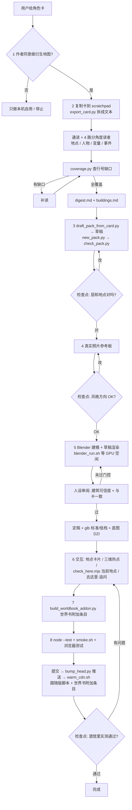

# card-map 技能是怎么工作的

这份是给人看的说明，可以随便改。给代理看的步骤在同目录的 `SKILL.md`。

## 怎么触发

- 先装一次：Claude Code 只在 `.claude/skills/` 或 `~/.claude/skills/` 里找技能，而仓库的 `.claude/` 被 gitignore 了。在仓库根目录跑
  `mkdir -p .claude/skills && ln -s ../../skills/card-map .claude/skills/card-map`（每个 worktree 各跑一次；或者链到 `~/.claude/skills/card-map` 全局可用）。
- 在 Claude Code 里说「给这张卡做地图」「把 X 卡做成地图包」之类的话，或者直接打 `/card-map`。
- Claude Code 按 `SKILL.md` 开头的 `description` 判断要不要用这个技能。想让它更容易 / 更难被触发，就改那一段。
- 需要你提供：① 角色卡文件（PNG 或 JSON）② 卡引用的外部世界书（没有就不用给）③ 你平时挂着的附加世界书（可选）④ 原作者帖子链接，以及作者是否同意。卡只复制后读取，原文件不会被改。
- 前提：本机有 Blender、Node、Python 3，最好有 GPU；推送需要对仓库有写权限（没有就停在提交这一步，由你决定）。一张卡从读卡到交付通常要几小时到几天，大部分时间在建模渲染。

## 整体流程

## 你要拍板的地方（检查点）

| 步骤 | 问你什么 |
|---|---|
| 1 | 原作者同意了吗？原帖链接是什么？（不同意也能做，但只在本机自用，不推送、不发帖） |
| 3 | 层、地点、别名、当前地点变量路径、事件分类对不对 |
| 4 | 每栋主建筑的参考照片和风格方向行不行 |
| 8 | 在酒馆里导入跟随版脚本和世界书附加条目，按 `docs/tt-test-checklist.md` 实测是否正常 |

其余步骤代理自己做完再汇报。

## 自动 / 手动

| 自动（工具做） | 手动（代理或你做） |
|---|---|
| 拆卡、数行数（`export_card.py`） | 读卡、写摘要和建筑清单 |
| 查读卡缺口（`coverage.py`） | 补读缺口 |
| 从世界书标题起草地点、猜 MVU 地点路径（`draft_pack_from_card.py`） | 核对草稿、挪层、补漏掉的地点 |
| 生成包骨架、占位底图（`new_pack.py`）、检查（`check_pack.py`） | 在查看器里点坐标 |
| 等 GPU 空闲、记 PID（`blender_run.sh`） | 写每栋的 `build.py`、看草稿、按审阅改 |
| 审阅简报和提示词（`tools/review/pack.py --stage landmark`） | 派审阅代理、汇总 |
| glb 压缩、切瓦片（gltf-transform、`make_dzi.py`、`region_patch.py`） | 写三维清单和热点 |
| 当前地点落点自查（`check_here.mjs`） | 补别名 |
| 世界书附加条目（`build_worldbook_addon.py`） | 写 `worldbook.json` 里的规则条目 |
| 测试、推送、预热 CDN、生成脚本 | 在酒馆里实测 |

## 读什么、写什么

**只读**
- 你的角色卡：只读它在 scratchpad 里的副本，从不写酒馆（SillyTavern / 酒馆助手）的数据目录。
- 仓库文档：`docs/onboarding.md`、`docs/generalize/README.md`、`docs/card-reading.md`、`docs/tooling.md`、`docs/versioning.md`。

**写在 scratchpad（不进仓库）**
- 卡的副本和拆出的文本、读者报告、`digest.md`、`buildings.md`
- 包草稿 `<id>.draft.json`
- 草稿渲染、参考图、`.blend`、未压缩的 glb、审阅报告

**写进仓库**
- `map/packs/<id>/`：`manifest.json`、`maps.json`、各层 `<地图 id>.json`、`events.json`、`worldbook.json`、`art/` 瓦片
- `blender/landmarks/<建筑>/build.py`、`map/props/<建筑>/`（glb + 清单）
- `docs/<id>-references.md`（参考链接）
- 浏览器测试 `tools/browser/pack_<id>.mjs`（照 `pack_town.mjs` 改）
- `map/data/head.json`（`bump_head.py` 推送时写）

**交付给用户（在 `~/Downloads/酒馆/`）**
- 跟随版外挂脚本（`build_preview_script.py --follow … --pack <id>`，文件名形如 `【地图·<id>】…json`，在酒馆助手脚本库里导入）
- 世界书附加条目（`build_worldbook_addon.py --pack <id>`，一个世界书 JSON，在酒馆世界书里导入）
- 不生成、不修改角色卡。

## 词表

- 主建筑（hero）：要单独做三维模型的重要建筑。
- MVU：卡里记录「当前地点」等状态的变量（`stat_data`）。
- 设定包：一张卡的地图数据，放在 `map/packs/<id>/`。
- glb：三维模型文件；标准档 / 低档是两种精度。
- DZI：可缩放的底图瓦片。
- 跟随版：导入一次，之后每次刷新酒馆自动用分支上的最新提交。

## 辅助脚本一览

| 文件 | 做什么 |
|---|---|
| `export_card.py` | 卡 → 文本 + 行数 |
| `coverage.py` | 读者行号并集，列缺口 |
| `check_here.mjs` | 每个地点写法的落点自查 |
| `blender_run.sh` | 等别人的 Blender 退出再开渲，只记自己的 PID |
| `templates/smoke_building.py` | 最小单栋模型，用来试通建模 → 渲染 |
